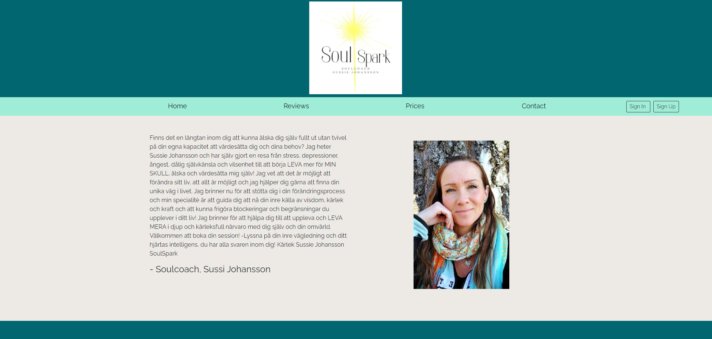
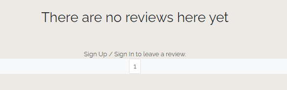
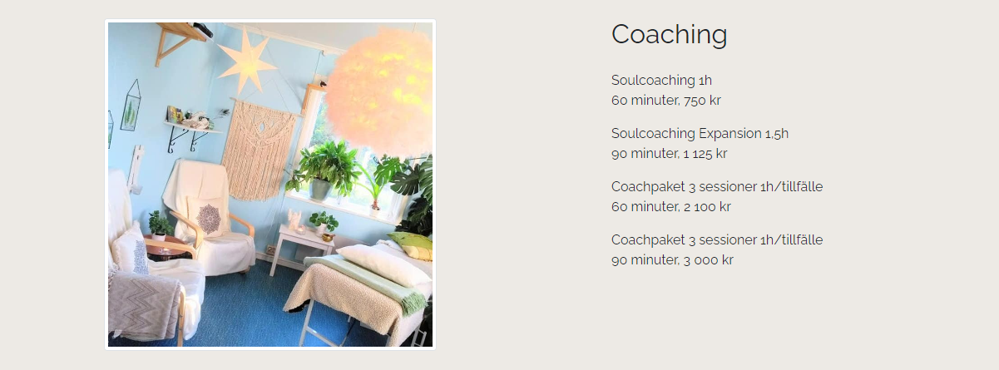
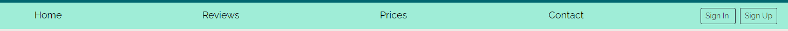

# SOULSPARK

The Soulspark website is a page used to promote the Soulspark coaching services. It also serves as a source of information for costumers interested in buying coaching services.

  

[Link to deployed site](https://soulspark-2b23afca50ab.herokuapp.com/)
---

## CONTENTS

* [User Experience](#user-experience-ux)
  * [User Stories](#user-stories)

* [Design](#design)
  * [Colour Scheme](#colour-scheme)
  * [Typography](#typography)
  * [Imagery](#imagery)
  * [Wireframes](#Wireframes)

* [Features](#features)
  * [General Features on Each Page](#general-features-on-each-page)
  * [Future Implementations](#future-implementations)

* [Technologies Used](#technologies-used)
  * [Languages Used](#languages-used)
  * [Frameworks, Libraries & Programs Used](#frameworks-libraries--programs-used)

* [Deployment & Local Development](#deployment--local-development)
  * [Deployment](#deployment)
  * [Local Development](#local-development)
    * [How to Fork](#how-to-fork)
    * [How to Clone](#how-to-clone)

* [Testing](#testing)

* [Credits](#credits)
  * [Code Used](#code-used)
  * [Content](#content)
  * [Media](#media)

---

## User Experience (UX)

Certified coach Sussie Johansson is offering coaching services through her bussiness Soulspark. The web page offers potential costumers an overview of what services are offered as well as ways get in touch with Sussie. Costumers are also able to log in and leave reviews on the web page.

### User Stories

Clients goals:
* To be able to market the bussiness and reach out through a web page instead of only using social media.
* To be aböe to present what services the bussiness offers to potential clients.
* To be able to market and get feedback through costumer reviews.

First Time Visitor Goals:
* To be able to see what kind of bussiness this is.
* To be able to see what services are offered.
* To be able to see what previous costumers have said about the services.
* To be able to find out more by links to social accounts.

Returning Visitor Goals:
* To be able to find contact information to Sussie.
* To find out how to book an appointment.
* To be able to write a review.

Frequent Visitor Goals:
* To be able to keep updated with changes in services.

## Design

### Colour Scheme

The client go to pick colour scheme from this page: https://visme.co/blog/website-color-schemes/
She had three she liked better. I picked the one I thought it worked best with her logo.

  

### Typography

I used the Raleway font from Google Fonts. I thought it worked well with the style of the logo and the services.

[Google Fonts](https://fonts.google.com/) is a popular choice for importing fonts to use in your project, as it doesn't require you to download the fonts to use them.

 

### Imagery

The imagery is mainly of Sussie and her fascilities, showing a friendly and peaceful enviroment.

### Wirerfames

Wireframes of the index page was made:

 

## Features

The web page has a "Home" page with a greeting from the bussiness owner explaining what it is she does. 

There is also a page where costumers can leave and read reviews. In case of many reviews a pagination function is added.

 

 Services and prices can be found on another page. 

  
 
 There is also a page with contact information as well as pages for signing up and signing in and out of an account.

### General features on each page

The web page has a navigation menu, making it easy to navigate between pages.

  

### Future Implementations

In the future I would like to add a booking system directly on the web page instead of linking to an outside service. The page would also benefit from a page were news of project of services can be posted.

## Technologies Used

### Languages Used

HTML, CSS, Python, Django

### Frameworks, Libraries & Programs Used

Bootstrap - To help create a nice layout.

Github - To store and showcase project code.

Gitpod - Used for writing code.

Heroku - Used for deployment

Google Fonts - Import fonts to use in project.

Google Dev Tools - To help troubleshoot features on the page.

## Deployment & Local Development

The project has been deployed through Heroku.

### Deployment

- Logged in to Heroku account, create a new Heroku app,
- Link the Heroku app to the Github repository used for the project.
- Deploy the app.

### Local Development

The local development section gives instructions on how someone else could make a copy of your project to play with on their local machine. This section will get more complex in the later projects, and can be a great reference to yourself if you forget how to do this.

#### How to Fork

Log in to Github.
Go to the repository for the [Soulspark](https://github.com/ElisabethKAndersson/Portfolio-project-4) project.
Click the Fork button to de right above the code.

#### How to Clone

Log in to Github.
Go to the repository for the [Soulspark](https://github.com/ElisabethKAndersson/Portfolio-project-4) project.
Click on the code button. 
Choose if you want to clone through HTTP, SSH or GitHub CLI.
Copy the link.
Open the terminal in your code editor and change the current working directory to the location you want to use for the cloned directory.
Type 'git clone' into the terminal and then paste the link you copied in step 3. Press enter.

## Testing

Information about testing can be found [here](TESTING.md)

## Credits

I would like to thank the people who helped me along the way in completing this project:

My Code Institute Mentor Jubril Akolade
Tutor Support team at Code Institute.
My kids for being understanding when I am a bit busier than usually.

### Code Used

Pagination code was created with the help of this youtube tutorial: https://youtu.be/N-PB-HMFmdo?si=4F_3XYxFpD4D8ii2

I also had help from the following sites when writing code for the review function:
https://stackoverflow.com/questions/24629705/django-using-get-user-model-vs-settings-auth-user-model
https://stackoverflow.com/questions/35978476/how-to-display-the-post-user-created-with-if-user-is-authenticated-post-au
https://forum.djangoproject.com/t/automatically-get-user-id-to-assignate-to-form-when-submitting/5333/8

### Content

The content was mostly written by Sussie Johansson who is the running the Soulspark bussiness.

###  Media

All images have been required from Sussie Johansson.
  
